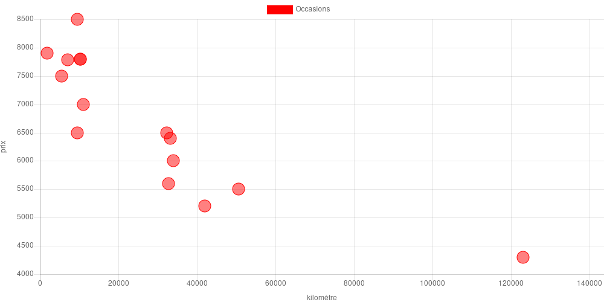

Documentation
=============

Ces scripts permettent de visualiser la "courbe" de tendance des prix d'annonces présentes sur le site leboncoin.
Les scripts s'exécutent côté serveur avec nodejs.

Un premier script permet de récupérer les annonces répondant à vos critères. Un seond script génère le graphique. Les annonces sont récupéres au format JSON.

Prérequis
---------

* nodejs

Instructions
------------

préciser vos critères en modifiant le script getAnnonces.js puis :

    node getAnnonce.js > annonces.json
    node graph.js < annonces.json

See also
--------

la doc de l'API leboncoin sur https://durieux.me/projects/leboncoin.html
